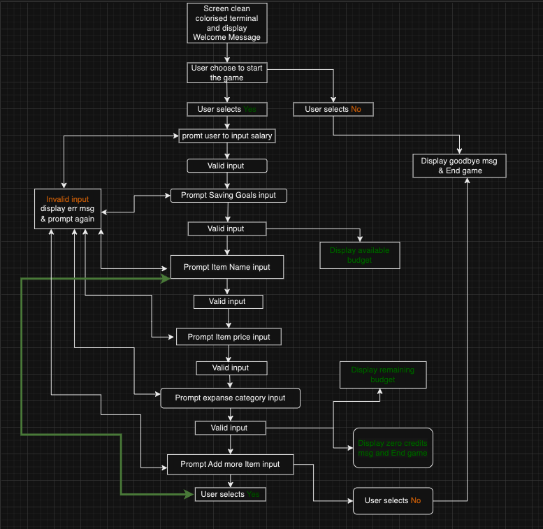

# Budget Buddy

[Live project here](https://budget-buddy-pp3-4bd1f0ed3b49.herokuapp.com/)

## Introduction

**Budget Buddy** is a user-friendly application designed to help users manage their monthly budget by tracking income and expenses. This project aims to provide an intuitive and interactive way for individuals to monitor their finances and make informed financial decisions.

## Contents

* [User Experience](#user-experience)
   * [User Benefits](#user-benefits)
   * [User Stories](#user-stories)
   * [Program Flowchart](#program-flowchart)
* [Features](#features)
   * [Welcome Message](#welcome-message)
   * [Expense Input](#expense-input)
   * [Budget Calculation](#budget-calculation)
   * [Immediate Feedback](#immediate-feedback)
   * [Expense Category Selection](#expense-category-selection)
   * [Future Development Plan](#future-development-plan)
   * [Detailed Reports](#detailed-reports)
   * [Savings Goals Tracking](#savings-goals-tracking)
   * [Expense Alerts](#expense-alerts)
   * [Multi-Income Source Support](#multi-income-source-support)
   * [Data Storage Integration with Google Sheets](#data-storage-integration-with-google-sheets)
   * [Web Interface with HTML and CSS](#web-interface-with-html-and-css)
   * [Date and Time Management for Budget Tracking](#date-and-time-management-for-budget-tracking)
* [Testing](#testing)
* [Bugs](#bugs)
* [Technologies Used](#technologies-used)
* [Version Control](#version-control)
* [Deployment](#deployment)
* [Credits](#credits)
   * [Code Used](#code-used)
* [Acknowledgements](#acknowledgements)

## User Experience

### User Benefits

- **Interactive Budgeting**: Users can input their income and expenses, and immediately see the impact on their budget.
- **Self-paced Management**: Users can add expenses and income entries at their convenience, allowing for flexible financial tracking.
- **Immediate Feedback**: The application provides instant updates on the remaining budget, helping users to stay on top of their spending.

[Go to Contents](#contents)

## User Stories

### Background
Budget Buddy was created to provide users with an efficient way to manage their monthly budget. The application allows users to track a single income source (salary) and various expenses, helping them gain clear insights into their spending habits. It includes features like color-coded messages and styled terminal outputs to enhance readability and user experience.

### Motivations and Goals
- **Project Purpose:** This Python script was created to help individuals manage their finances more effectively. The project demonstrates skills in Python by developing a simple yet powerful budget calculating application, enabling users to track their income and expenses, set financial goals, and make informed financial decisions.
- **Financial Organization:** Users aim to keep their finances well-organized by tracking a single income source (salary) and various expenses.
- **Time Management:** They seek tools that help them quickly and efficiently manage budgeting tasks.
- **Financial Insights:** They appreciate tools that provide clear insights into spending habits and assist in making informed financial decisions.

### How Users Utilize Budget Buddy
- **Salary Tracking:** Users log their monthly salary.
- **Expense Categorization:** They categorize expenses to understand spending patterns and identify potential savings areas.
- **Monthly Budget Review:** At the end of each month, users review their financial activity to plan for the next month.

### Reasons Users Love Budget Buddy
- **Comprehensive Tracking:** Enables detailed logging of both income (salary) and expenses.
- **Immediate Feedback:** Provides real-time updates on the remaining budget.
- **User-friendly Design:** Makes managing finances straightforward and hassle-free.
- **Enhanced Readability:** The project uses different colors, bold text, and background colors to make the terminal interface more attractive and user-friendly.
- **Color-coded Messages:** Printed messages are color-coded based on the type of output, enhancing the user experience and readability of the information.

[Go to Contents](#contents)

## Program Flowchart

Below is a text-based representation of the flowchart for clarity:

[Go to Contents](#contents)

## Features

### Welcome Message

**Description:** Greets the user and provides an overview of the application.  
**Value:** Sets a friendly tone and informs users about the purpose of the application.    

[Go to Contents](#contents)

### Expense Input

**Description:** Allows users to enter descriptions, categories, and amounts for their expenses.  
**Value:** Provides a structured way for users to record their spending.  

[Go to Contents](#contents)

### Budget Calculation

**Description:** Calculates the remaining budget after each expense entry.  
**Value:** Helps users stay aware of their financial status in real-time.  

[Go to Contents](#contents)

### Immediate Feedback

**Description:** Provides instant updates on the remaining budget after each expense entry.  
**Value:** Reinforces financial awareness and helps users make informed decisions.  

[Go to Contents](#contents)

### Expense Category Selection

**Description:** Allows users to categorize their expenses for better organization.  
**Value:** Helps users see where their money is going by categorizing expenses.  

[Go to Contents](#contents)

## Future Development Plan

### Detailed Reports

**Description:** 
- Generate financial reports with visual charts and graphs.
- Customizable date ranges and categories for detailed analysis.

**Value:** 
- Provides insights into spending habits and financial trends.
- Helps users make informed budgeting decisions.

**Implementation Plan:** 
- Aggregate income and expense data.
- Allow export in formats such as PDF, Excel, or CSV.

[Go to Contents](#contents)

### Savings Goals Tracking

**Description:** 
- Set and track savings goals with visual progress indicators.

**Value:** 
- Encourages better savings habits and goal achievement.

**Implementation Plan:**
- Develop goal setting and progress tracking features.
- Add reminders and notifications.

[Go to Contents](#contents)

### Expense Alerts

**Description:**
- Notify users when they exceed budget limits in specific categories.

**Value:**
- Helps users avoid overspending and manage budgets effectively.

**Implementation Plan:**
- Allow users to set spending thresholds.
- Develop an alert system for budget limits.

[Go to Contents](#contents)

### Multi-Income Source Support

**Description:**
- Track multiple income sources besides salary.

**Value:**
- Provides a comprehensive view of total income.

**Implementation Plan:**
- Develop features to input and categorize various income sources.
- Create summary views of total income.

[Go to Contents](#contents)

### Data Storage Integration with Google Sheets

**Description:**
- Store and manage data in Google Sheets with sync options.

**Value:**
- Enhances data accessibility and backup.

**Implementation Plan:**
- Integrate Google Sheets API for data storage and management.
- Develop a sync feature for updating data.

[Go to Contents](#contents)

### Web Interface with HTML and CSS

**Description:**
- Create a web-based interface using HTML and CSS.
- Ensure responsive design for all devices.

**Value:**
- Makes the application accessible through web browsers.
- Provides a user-friendly and visually appealing interface.

**Implementation Plan:**
- Use HTML and CSS for web development.
- Implement responsive design techniques.

[Go to Contents](#contents)

### Date and Time Management for Budget Tracking

**Description:**
- Track budget over specific periods with date and time functions.
- Calculate the next salary date based on the start date.

**Value:**
- Provides accurate tracking of income and expenses.

**Implementation Plan:**
- Add features for date entry and calculations.
- Enable periodic tracking for better financial management.

[Go to Contents](#contents)

## Testing

I conducted extensive manual testing of the Budget Buddy application to ensure its functionality and reliability. Here's an overview of the testing process and outcomes:

- **Manual Testing**: I personally tested the application multiple times on different devices and environments to verify its performance. This testing included various scenarios, both positive and negative, to ensure all input validations were thoroughly checked and functioning as expected.

- **Peer Review**:  shared the application with friends, classmates, requesting their feedback and insights. They tested various features and provided valuable input on usability and functionality.

> NOTE  
> Return back to the [TESTING.md](TESTING.md) file.

[Go to Contents](#contents)

## Bugs

Initially, the Budget Buddy project started with three main functions, which caused various errors. To resolve these, I refactored the code into multiple small, isolated functions for specific input types. Now, there are no noticeable bugs to report.

[Go to Contents](#contents)

## Technologies Used

- **Markdown Builder:** Used to generate README and TESTING templates.
- **Git:** Used for version control (`git add`, `git commit`, `git push`).
- **GitHub:** Used for secure online code storage.
- **Gitpod:** Used as a cloud-based IDE for development.
- **Python:** Used as the back-end programming language.
- **Heroku:** Used for hosting the deployed back-end site.
- **VS Code:** Used as a local development environment.
- **pylint:** Used for code quality and style checking in Python.

[Go to Contents](#contents)

## Version Control

Throughout the development process, I used basic Git commands to manage version control. All necessary files were included in the repository. Here are the main commands I used:

- `git add 'file_name'`: Added specific files to the staging area before committing changes.
- `git add .`: Added all files to the staging area before committing changes.
- `git commit -m "commit message"`: Committed the staged changes with descriptive messages to track project progress.
- `git push`: Pushed local commits to the remote repository on GitHub, ensuring the latest changes were synchronized with the online repository.

[Go to Contents](#contents)

## Deployment

I deployed the Budget Buddy using Heroku's dashboard. Here’s how I did it:

1. **Creating a Heroku App**: Logged into Heroku, created a new app, and chose a unique name and region.
2. **Connecting to GitHub**: Linked my GitHub account and selected the Budget Buddy repository.
3. **Configuring Environment Variables**: Set necessary environment variables in the "Settings" tab.
4. **Installing Buildpacks**: Added Python and Node.js buildpacks in the "Buildpacks" section to handle dependencies.
5. **Configuring Automatic Deploys**: Enabled automatic deploys for seamless updates from GitHub.
6. **Manual Deployments**: Used the manual deploy option to deploy specific branches when needed.
7. **Verifying Deployment**: Verified the deployment by opening the provided Heroku URL and checking the app.

[Go to Contents](#contents)

## Credits

### Resources Used

- **[Code Institute learning materials](https://codeinstitute.net/)**: For providing helpful learning resources and guidance during the development process.

- **[Python documentation](https://www.python.org/doc/)**: For offering detailed explanations and references that helped me implement different features.

- **[W3Schools Python exercises](https://www.w3schools.com/python/)**: For providing practical exercises and tutorials that reinforced my Python skills.

- **[Heroku](https://www.heroku.com/)**: For offering easy-to-use deployment and hosting services for the application.

- **[Github repo](https://github.com/ibra8080/ArabiaChallenge)**: file structure and approach were inspired by this repository. This repo provided a comprehensive guide on how to document testing processes, which I have implemented similarly in my project.

- **[Dave Gray](https://www.youtube.com/watch?v=qwAFL1597eM&t=22910s)**: Very handy for beginners like me in Python. The 8-hour long tutorial explains everything from zero to advanced concepts

- **[FreeCodeCamp](https://www.youtube.com/watch?v=pdy3nh1tn6I&t=8427s)**: Very handy for beginners like me in Python. Includes 20 small projects with python

- **[Programming with Mosh](https://www.youtube.com/watch?v=kqtD5dpn9C8)**: This 1-hour tutorial explains core concepts of Python for beginners, providing a solid foundation.

- **[YouTube Tutorial](https://www.youtube.com/watch?v=Dn1EjhcQk64&t=1411s)**: Learned how to use `raise` error and handle exceptions effectively.

[Go to Contents](#contents)

### Code Used

- **[GeeksforGeeks](https://www.geeksforgeeks.org/clear-screen-python/)**: Learned how to implement the `clear_screen` function from this link.

- [Github repo](https://gist.github.com/vratiu/9780): The `colors.py` Color codes were sourced from this repository.

- [Github repo](https://github.com/linuxlawson/buddy/blob/main/buddy.py): The `display_welcome_msg` method was inspired by this repository.

[Go to Contents](#contents)

## Acknowledgements

### Luke

I deeply thank my mentor, Luke, for his invaluable support and guidance from start to finish. He provided motivating feedback, suitable projects, and examples of success, making this project possible. Thank you, Luke, for your unwavering mentorship.

### Ioan

Huge thanks to my friend and classmate, Ioan, for his programming expertise. He suggested using smaller functions and explained the benefits of isolating them. This made a huge difference in my project, making the code clearer and easier to maintain. Ioan is like a real-life ChatGPT with his knowledge and clear explanations. I'm lucky to have him as a friend!

### Lorenz

Thanks to my classmate, Lorenz, for his detailed help with PEP8 issues in my Python code. He taught me various ways to format code properly and provided excellent resources. His guidance made using PEP8 for code checking much easier. 

### ChatGPT

Used to help debug, troubleshoot, and explain things, and help me write a more clear and concise README.md file.

[Go to Contents](#contents)