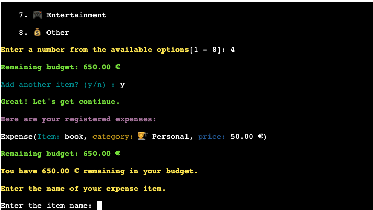

# Budget Buddy


[Live project here](https://budget-buddy-pp3-4bd1f0ed3b49.herokuapp.com/)

[Go to Contents](#contents)


## Introduction

**Budget Buddy** is a user-friendly application designed to help users manage their monthly budget by tracking income and expenses. This project aims to provide an intuitive and interactive way for individuals to monitor their finances and make informed financial decisions.

[Go to Contents](#contents)

## Contents

* [User Experience](#user-experience)
   * [User Benefits](#user-benefits)
   * [User Stories](#user-stories)
   * [Program Flowchart](#program-flowchart)
* [Features](#features)
   * [Welcome Message](#welcome-message)
   * [Expense Input](#expense-input)
   * [Budget Calculation](#budget-calculation)
   * [Immediate Feedback](#immediate-feedback)
   * [Expense Category Selection](#expense-category-selection)
* [Future Features](#future-features)
   * [Detailed Reports](#detailed-reports)
   * [Savings Goals Tracking](#savings-goals-tracking)
   * [Expense Alerts](#expense-alerts)
   * [Multi-Income Source Support](#multi-income-source-support)
   * [Data Storage Integration with Google Sheets](#data-storage-integration-with-google-sheets)
   * [Web Interface with HTML and CSS](#web-interface-with-html-and-css)
   * [Date and Time Management for Budget Tracking](#date-and-time-management-for-budget-tracking)
* [Technologies Used](#technologies-used)
* [Data Model](#data-model)
   * [Classes & Functions](#classes--functions)
* [Python Packages Used](#python-packages-used)
* [Credits](#credits)
   * [Code Used](#code-used)
* [Acknowledgements](#acknowledgements)

## User Experience

### User Benefits

- **Interactive Budgeting**: Users can input their income and expenses, and immediately see the impact on their budget.
- **Self-paced Management**: Users can add expenses and income entries at their convenience, allowing for flexible financial tracking.
- **Immediate Feedback**: The application provides instant updates on the remaining budget, helping users to stay on top of their spending.

[Go to Contents](#contents)

## User Stories

### Background
Budget Buddy was created as a part of a full-stack development program to demonstrate Python programming skills. The application provides a simple yet effective way to track a single income source (salary) and various expenses. It aims to help users manage their monthly budget efficiently by offering clear insights into their spending habits. The project also includes enhancements such as color-coded messages and styled terminal outputs to improve readability and user experience.

### Motivations and Goals
- **Project Purpose:** This Python script was created as part of a full-stack development program. The project demonstrates skills in Python by developing a simple budget calculating application.
- **Financial Organization:** Users aim to keep their finances well-organized by tracking a single income source (salary) and various expenses.
- **Time Management:** They seek tools that help them quickly and efficiently manage budgeting tasks.
- **Financial Insights:** They appreciate tools that provide clear insights into spending habits and assist in making informed financial decisions.

### How Users Utilize Budget Buddy
- **Salary Tracking:** Users log their monthly salary.
- **Expense Categorization:** They categorize expenses to understand spending patterns and identify potential savings areas.
- **Monthly Budget Review:** At the end of each month, users review their financial activity to plan for the next month.

### Reasons Users Love Budget Buddy
- **Comprehensive Tracking:** Enables detailed logging of both income (salary) and expenses.
- **Immediate Feedback:** Provides real-time updates on the remaining budget.
- **User-friendly Design:** Makes managing finances straightforward and hassle-free.
- **Enhanced Readability:** The project uses different colors, bold text, and background colors to make the terminal interface more attractive and user-friendly.
- **Color-coded Messages:** Printed messages are color-coded based on the type of output, enhancing the user experience and readability of the information.

[Go to Contents](#contents)

### Program Flowchart

## Program Flowchart

Below is a text-based representation of the flowchart for clarity:

```plaintext
Start
 |
 |-- Clear Screen
 |-- Import colors.py
 |-- Display Welcome Message
 |
 |-- Prompt: Start Game? (Yes/No)
     |
     |-- [Yes] --|
     |           |-- Display Start Message
     |           |-- Prompt: Enter Salary
     |           |-- Validate Salary
     |           |     |-- [Invalid] -- Display Error Message, Prompt Again
     |           |-- Prompt: Enter Saving Goals
     |           |-- Validate Saving Goals
     |           |     |-- [Invalid] -- Display Error Message, Prompt Again
     |           |-- Calculate and Display Available Budget
     |           |-- Expense Input Loop
     |           |     |-- Prompt: Enter Expense Item Name
     |           |     |-- Validate Item Name
     |           |     |     |-- [Invalid] -- Display Error Message, Prompt Again
     |           |     |-- Prompt: Enter Expense Item Price
     |           |     |-- Validate Item Price
     |           |     |     |-- [Invalid] -- Display Error Message, Prompt Again
     |           |     |-- Prompt: Select Expense Category
     |           |     |-- Calculate and Display Remaining Budget
     |           |     |-- [Remaining Budget Zero] -- Display Zero Credits Message, End Game
     |           |     |-- Prompt: Add More Items? (Yes/No)
     |           |     |     |-- [Yes] -- Continue Expense Input Loop
     |           |     |     |-- [No] -- Display Summary, Exit with Goodbye Message
     |
     |-- [No] --|
     |           |-- Display Goodbye Message, End Game
     |
     |-- [Invalid Input] -- Display Error Message, Prompt Again


[Go to Contents](#contents)

## Features

### Welcome Message

**Description:** Greets the user and provides an overview of the application.  
**Value:** Sets a friendly tone and informs users about the purpose of the application.  
**Implementation:** Implemented in the `display_welcome_msg` function.  


[Go to Contents](#contents)

### Expense Input

**Description:** Allows users to enter descriptions, categories, and amounts for their expenses.  
**Value:** Provides a structured way for users to record their spending.  
**Implementation:** Implemented in the `register_expense_items` function.  


[Go to Contents](#contents)

### Budget Calculation

**Description:** Calculates the remaining budget after each expense entry.  
**Value:** Helps users stay aware of their financial status in real-time.  
**Implementation:** Implemented within the main application logic.  


[Go to Contents](#contents)

### Immediate Feedback

**Description:** Provides instant updates on the remaining budget after each expense entry.  
**Value:** Reinforces financial awareness and helps users make informed decisions.  
**Implementation:** Implemented in the main application loop.  


[Go to Contents](#contents)

### Expense Category Selection

**Description:** Allows users to categorize their expenses for better organization.  
**Value:** Helps users see where their money is going by categorizing expenses.  
**Implementation:** Implemented in the `register_expense_items` function.  


[Go to Contents](#contents)

## Future Features

### Detailed Reports

**Description:** 
- Generate financial reports with visual charts and graphs.
- Customizable date ranges and categories for detailed analysis.

**Value:** 
- Provides insights into spending habits and financial trends.
- Helps users make informed budgeting decisions.

**Implementation Plan:** 
- Aggregate income and expense data.
- Allow export in formats such as PDF, Excel, or CSV.

### Savings Goals Tracking

**Description:** 
- Set and track savings goals with visual progress indicators.

**Value:** 
- Encourages better savings habits and goal achievement.

**Implementation Plan:**
- Develop goal setting and progress tracking features.
- Add reminders and notifications.

### Expense Alerts

**Description:**
- Notify users when they exceed budget limits in specific categories.

**Value:**
- Helps users avoid overspending and manage budgets effectively.

**Implementation Plan:**
- Allow users to set spending thresholds.
- Develop an alert system for budget limits.

### Multi-Income Source Support

**Description:**
- Track multiple income sources besides salary.

**Value:**
- Provides a comprehensive view of total income.

**Implementation Plan:**
- Develop features to input and categorize various income sources.
- Create summary views of total income.

### Data Storage Integration with Google Sheets

**Description:**
- Store and manage data in Google Sheets with sync options.

**Value:**
- Enhances data accessibility and backup.

**Implementation Plan:**
- Integrate Google Sheets API for data storage and management.
- Develop a sync feature for updating data.

### Web Interface with HTML and CSS

**Description:**
- Create a web-based interface using HTML and CSS.
- Ensure responsive design for all devices.

**Value:**
- Makes the application accessible through web browsers.
- Provides a user-friendly and visually appealing interface.

**Implementation Plan:**
- Use HTML and CSS for web development.
- Implement responsive design techniques.

### Date and Time Management for Budget Tracking

**Description:**
- Track budget over specific periods with date and time functions.
- Calculate the next salary date based on the start date.

**Value:**
- Provides accurate tracking of income and expenses.

**Implementation Plan:**
- Add features for date entry and calculations.
- Enable periodic tracking for better financial management.

[Go to Contents](#contents)

## Technologies Used

- **Markdown Builder:** Used to generate README and TESTING templates.
- **Git:** Used for version control (`git add`, `git commit`, `git push`).
- **GitHub:** Used for secure online code storage.
- **Gitpod:** Used as a cloud-based IDE for development.
- **Python:** Used as the back-end programming language.
- **Heroku:** Used for hosting the deployed back-end site.
- **ChatGPT:** Used to help debug, troubleshoot, and explain things, and help me write a more clear and concise README.md file.

[Go to Contents](#contents)


## Data Model

### Classes & Functions

The Budget Buddy project uses various functions to modularize the code, ensuring reusability, maintainability, and clarity. Here is an overview of the primary functions used in this application:

- `clear_screen()`: Clears the terminal to maintain a clean user interface.
- `display_welcome_msg()`: Displays a welcome message to the user.
- `get_user_confirmation()`: Confirms if the user wants to start the budgeting process.
- `add_more_item()`: Prompts the user to add more items after the first round.
- `get_validated_input(prompt, validation_function, *args)`: Validates user input using the specified validation function.
- `register_expense_items(available_budget, saving_goals)`: Collects user expense items and categorizes them.

[Go to Contents](#contents)

## Python Packages Used

The Budget Buddy application relies on the following Python packages for its functionality:

- **os**: Used for system-specific operations and clearing the terminal.
- **sys**: Utilized for system-specific parameters and functions.
- **time**: Used to add delays (`sleep(0.5)`) for displaying messages right after the welcome message.
- **colors**: Custom module for adding color to terminal output.


[Go to Contents](#contents)

## Credits

### Libraries and Tools

- **os**: Used for system-specific operations and clearing the terminal.
- **sys**: Utilized for system-specific parameters and functions.
- **time**: Provides various time-related functions.
- **colors**: Custom module for adding color to terminal output, imported from `colors.py` file

[Go to Contents](#contents)

### Code Used

- [Github repo](https://gist.github.com/vratiu/9780): The `colors.py` Color codes were sourced from this repository.

- [Github repo](https://github.com/linuxlawson/buddy/blob/main/buddy.py): The `display_welcome_msg` method was inspired by this repository.

- [Github repo](https://github.com/ibra8080/ArabiaChallenge): file structure and approach were inspired by this repository. This repo provided a comprehensive guide on how to document testing processes, which I have implemented similarly in my project.


## Acknowledgements

### Luke

I deeply thank my mentor, Luke, for his invaluable support and guidance from start to finish. He provided motivating feedback, suitable projects, and examples of success, making this project possible. Thank you, Luke, for your unwavering mentorship.

### Ioan

Huge thanks to my friend and classmate, Ioan, for his programming expertise. He helped me manage complex functions by suggesting smaller sub-functions, making my work easier. Ioan is like a real-life ChatGPT with his knowledge and clear explanations. I'm lucky to have him as a friend!

### Lorenz

Thanks to my classmate, Lorenz, for his detailed help with PEP8 issues in my Python code. He taught me various ways to format code properly and provided excellent resources. His guidance made using PEP8 for code checking much easier. 

[Go to Contents](#contents)