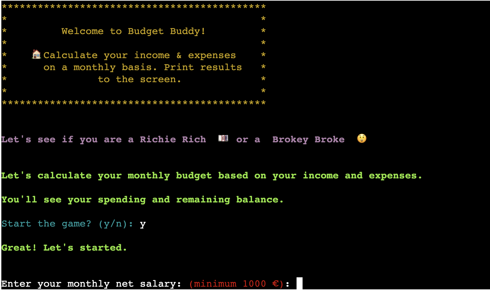
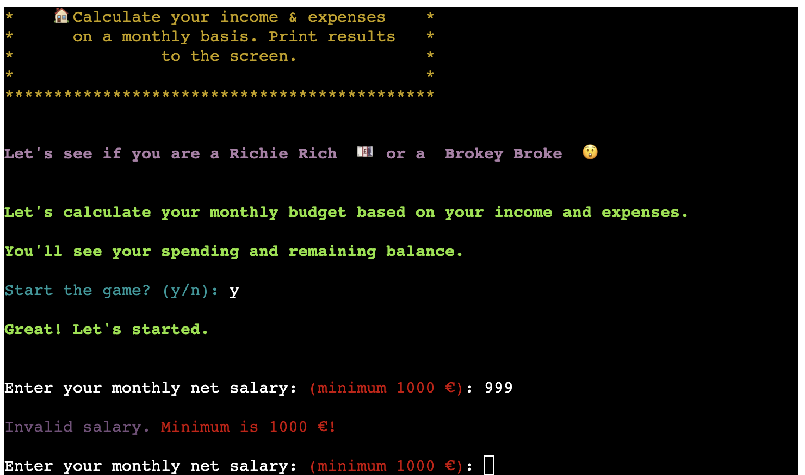
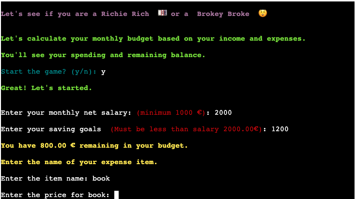
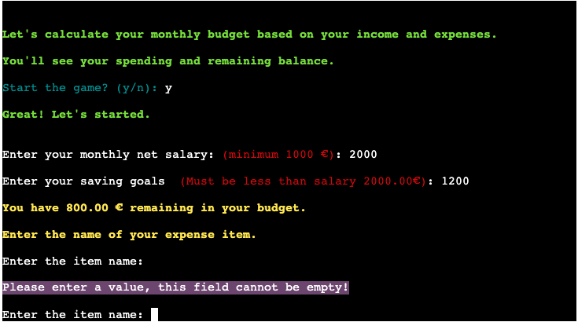
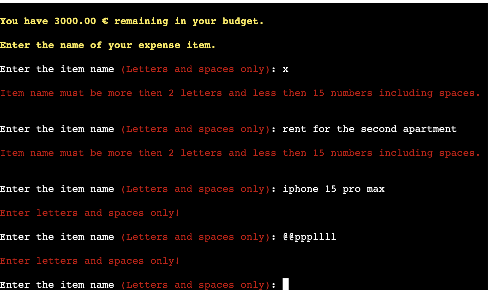
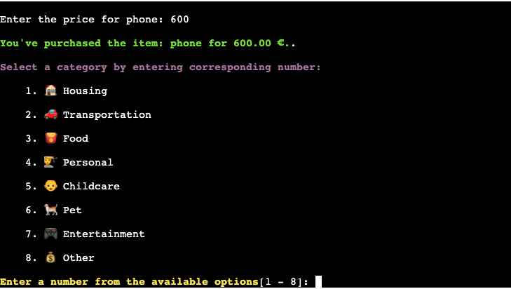
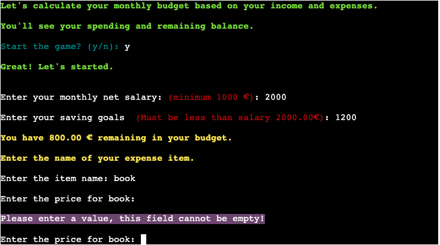
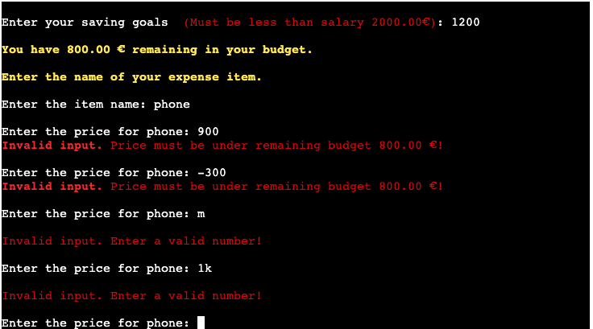

# Testing

## Manual Testing

Manual testing was conducted to ensure that all functionalities work correctly and provide the expected output. The following checks were confirmed:

| Test Case                        | Description                                                                                                                 | Expected Result                                                                                  | Status | Screenshot |
| -------------------------------- | --------------------------------------------------------------------------------------------------------------------------- | ------------------------------------------------------------------------------------------------ | ------ | ---------- |
| Clear Screen                     | Verified that the screen is cleared at the start of the program.                                                             | Terminal screen is cleared. And displays welcome message.                                        | Passed |  |
| User Confirmation - Yes          | Verified that the user is prompted to start the program and input 'Y' starts the application.                                | Program starts with 'Y' input and displays get start message.                                    | Passed |  |
| User Confirmation - No           | Verified that the user is prompted to start the program and input 'N' exits the application with a goodbye message.           | Program exits with 'N' input and displays goodbye message.                                       | Passed |  |
| User Confirmation - Invalid Input| Verified that invalid inputs are handled correctly and the user is prompted again.                                           | User is prompted again for valid input 'Y' or 'N'.                                               | Passed |  |
| Salary Input - Valid             | Ensured that the user is prompted to enter their salary and the input is validated correctly.                                | User is prompted for salary, and valid input is accepted.                                        | Passed |  |
| Salary Input - Below Minimum     | Verified that salary below the minimum (1000) is handled correctly.                                                          | Error message is displayed and user is prompted again.                                           | Passed |  |
| Salary Input - Invalid           | Verified that non-numeric and empty inputs are handled correctly.                                                            | Error message is displayed and user is prompted again.                                           | Passed |  |
| Saving Goals Input - Valid       | Ensured that the user is prompted to enter saving goals and the input is validated correctly.                                | User is prompted for saving goals, and valid input is accepted.                                  | Passed |  |
| Saving Goals Input - Invalid     | Verified that non-numeric, empty, and goals exceeding salary inputs are handled correctly.                                   | Error message is displayed and user is prompted again.                                           | Passed |  |
| Available Budget Display         | Checked that the available budget is calculated and displayed correctly.                                                     | Available budget is displayed based on salary and saving goals.                                  | Passed |  |
| Expense Item Name - Valid        | Ensured that the user can enter a valid item name.                                                                           | User can enter valid item name without errors.                                                   | Passed |  |
| Expense Item Name - Empty        | Verified that entering an empty value for item name prompts an error message.                                                | Error message is displayed for empty item name input.                                            | Passed |  |
| Expense Item Name - Invalid      | Ensured that entering invalid values for item name (e.g., numbers) prompts an error message.                                 | Error message is displayed for invalid item name input.                                          | Passed |  |
| Expense Item Price - Valid       | Ensured that the user can enter a valid item price.                                                                          | User can enter valid item price without errors.                                                  | Passed |  |
| Expense Item Price - Empty       | Verified that entering an empty value for item price prompts an error message.                                               | Error message is displayed for empty item price input.                                           | Passed |  |
| Expense Item Price - Invalid     | Ensured that entering invalid values for item price (e.g., non-numeric) prompts an error message.                            | Error message is displayed for invalid item price input.                                         | Passed |  |
| Expense Category Selection       | Verified that expense categories are displayed and selected correctly.                                                      | Expense categories are displayed for user selection.                                             | Passed |  |
| Budget Calculation               | Ensured that the remaining budget is calculated correctly after each expense entry.                                          | Remaining budget is correctly updated after each expense.                                        | Passed |  |
| Immediate Feedback - 0 Credits   | Verified that the application handles the scenario where the user has 0 credits left after entering expenses.                | Displays a message indicating that the user has 0 credits left and prevents further expense entries. | Passed |  |
| Add More Items - Yes             | Ensured that the user is prompted to add more items after the first round of entries and the previous items are displayed.    | User is prompted to add more items or exit the program. Previous items and remaining budget are displayed. | Passed |  |
| Add More Items - No              | Verified that the user can choose not to add more items and exit the program.                                                 | User can exit the program by confirming their choice with a goodbye message.                      | Passed |  |
| Add More Items - Invalid Input   | Verified that invalid inputs are handled correctly and the user is prompted again.                                           | User is prompted again for valid input 'Y' or 'N'.                                               | Passed |  |
| End of Program                   | Ensured that the program exits gracefully and displays a goodbye message when the user chooses to exit.                      | Program exits with a goodbye message.                                                            | Passed |  |

