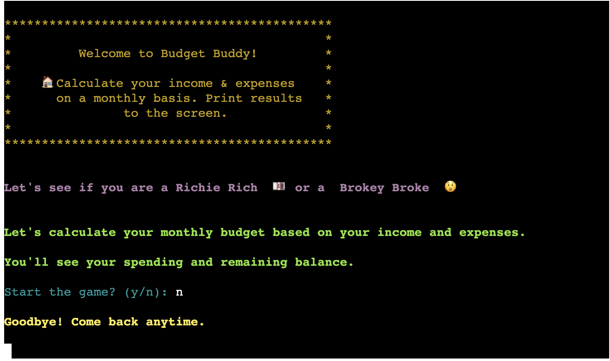
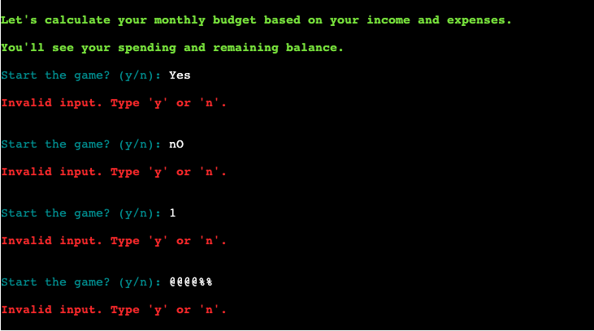
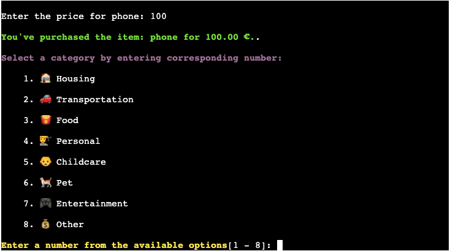

# Testing

## Manual Testing

Manual testing was conducted to ensure that all functionalities work correctly and provide the expected output. The following checks were confirmed:

| Test Case                        | Description                                                                                                                 | Expected Result                                                                                  | Status | Screenshot |
| -------------------------------- | --------------------------------------------------------------------------------------------------------------------------- | ------------------------------------------------------------------------------------------------ | ------ | ---------- |
| Clear Screen                     | Verified that the screen is cleared at the start of the program.                                                             | Terminal screen is cleared. And displays welcome message.                                                                    | Passed |  |
| User Confirmation - Yes          | Verified that the user is prompted to start the program and input 'Y' starts the application.                                | Program starts with 'Y' input and displays get start message.                                      | Passed |  |
| User Confirmation - No           | Verified that the user is prompted to start the program and input 'N' exits the application with a goodbye message.           | Program exits with 'N' input and displays goodbye message.                                       | Passed |  |
| User Confirmation - Invalid Input| Verified that invalid inputs are handled correctly and the user is prompted again.                                           | User is prompted again for valid input 'Y' or 'N'.                                               | Passed |  |
| Salary Input - Valid             | Ensured that the user is prompted to enter their salary and the input is validated correctly.                                | User is prompted for salary, and valid input is accepted.                                        | Passed |  |
| Salary Input - Below Minimum     | Verified that salary below the minimum (1000) is handled correctly.                                                          | Error message is displayed and user is prompted again.                                           | Passed |  |
| Salary Input - Invalid           | Verified that non-numeric and empty inputs are handled correctly.                                                            | Error message is displayed and user is prompted again.                                           | Passed |  |
| Saving Goals Input - Valid       | Ensured that the user is prompted to enter saving goals and the input is validated correctly.                                | User is prompted for saving goals, and valid input is accepted.                                  | Passed |  |
| Saving Goals Input - Invalid     | Verified that non-numeric, empty, and goals exceeding salary inputs are handled correctly.                                   | Error message is displayed and user is prompted again.                                           | Passed |  |
| Available Budget Display         | Checked that the available budget is calculated and displayed correctly.                                                     | Available budget is displayed based on salary and saving goals.                                  | Passed |  |
| Expense Entry - Valid            | Ensured that the user can enter expense descriptions, categories, and amounts correctly.                                     | User can enter valid expense details and categories accurately.                                  | Passed |  |
| Expense Entry - Invalid          | Verified that invalid expense details (e.g., empty descriptions, non-numeric amounts) are handled correctly.                 | Error message is displayed and user is prompted again.                                           | Passed |  |
| Expense Category Selection       | Verified that expense categories are displayed and selected correctly.                                                      | Expense categories are displayed for user selection.                                             | Passed |  |
| Budget Calculation               | Ensured that the remaining budget is calculated correctly after each expense entry.                                          | Remaining budget is correctly updated after each expense.                                        | Passed |  |
| Immediate Feedback               | Verified that immediate feedback on the remaining budget is provided after each expense entry.                               | Immediate feedback on remaining budget is provided.                                              | Passed |  |
| Add More Items - Yes             | Ensured that the user is prompted to add more items after the first round of entries and the previous items are displayed.    | User is prompted to add more items or exit the program. Previous items and remaining budget are displayed. | Passed |  |
| Add More Items - No              | Verified that the user can choose not to add more items and exit the program.                                                 | User can exit the program by confirming their choice with a goodbye message.                      | Passed |  |
| Add More Items - Invalid Input   | Verified that invalid inputs are handled correctly and the user is prompted again.                                           | User is prompted again for valid input 'Y' or 'N'.                                               | Passed |  |
| Color-coded Messages             | Ensured that messages are color-coded based on their type (e.g., errors, confirmations) to enhance readability.               | Messages are displayed in appropriate colors.                                                    | Passed |  |
| Invalid Input Handling           | Verified that invalid inputs across various prompts (e.g., salary, saving goals, expenses) are handled gracefully.            | Invalid inputs are handled with appropriate error messages.                                      | Passed |  |
| End of Program                   | Ensured that the program exits gracefully and displays a goodbye message when the user chooses to exit.                      | Program exits with a goodbye message.                                                            | Passed |  |

